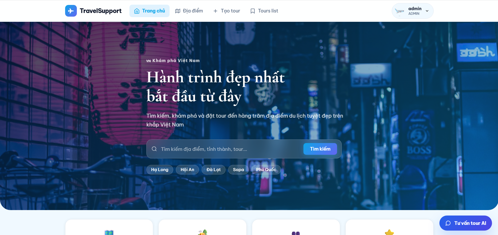
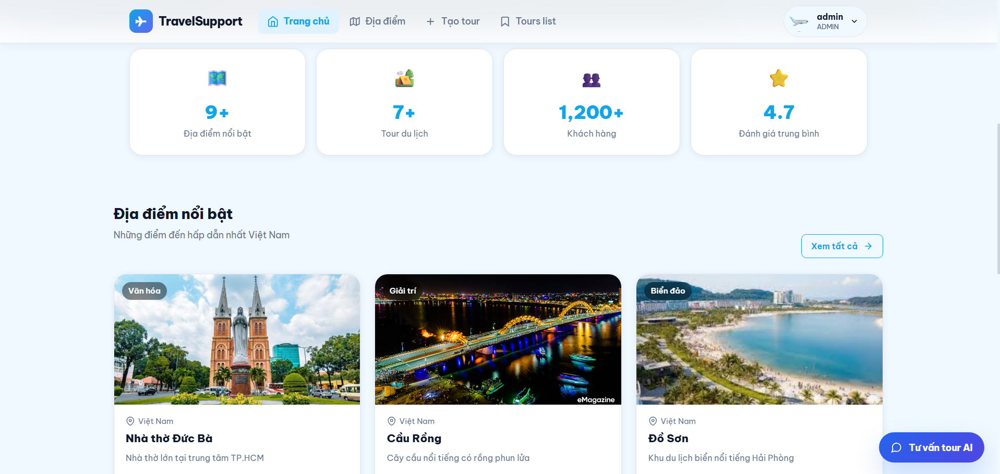
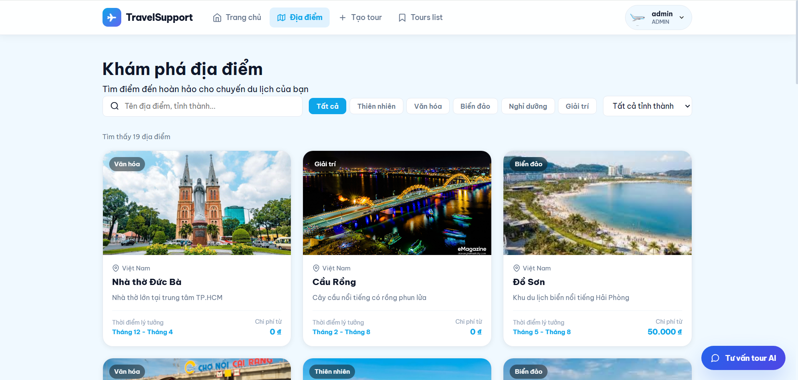
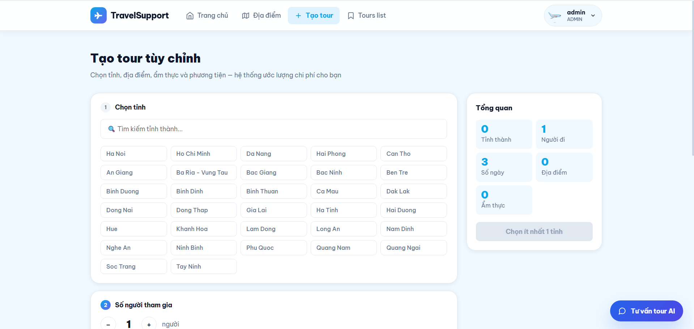
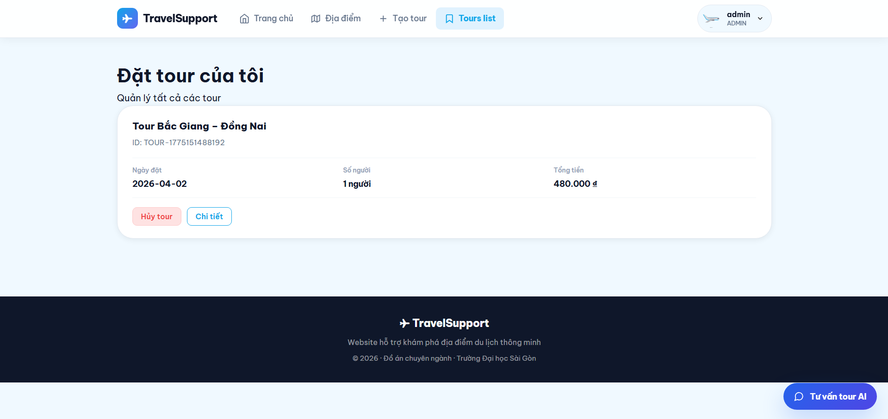

# TravelSupportWeb

**Giới thiệu**
- **Mục đích:** TravelSupportWeb là ứng dụng demo quản lý đăng nhập người dùng cho dự án hỗ trợ du lịch. Gồm `backend` (Spring Boot + JPA + MySQL) và `frontend` (React).

**Yêu cầu**
- Java 17+ và Maven
- Node.js 16+ và npm
- MySQL

**Cài đặt & Chạy Backend**
- Cấu hình kết nối MySQL trong `backend/src/main/resources/application.properties` (database `travelsupport`).
- Tạo database nếu chưa có:

```sql
CREATE DATABASE travelsupport CHARACTER SET utf8mb4 COLLATE utf8mb4_unicode_ci;
```

- Chạy backend:

```bash
cd backend
mvn clean spring-boot:run
```

**Cài đặt & Chạy Frontend**
- Cài dependencies và chạy:

```bash
cd frontend
npm install
npm start
```

- Mặc định frontend gọi API: `http://localhost:8080/api/login`.

**Kiểm tra API (Postman)**
- POST `http://localhost:8080/api/login`
- Header: `Content-Type: application/json`
- Body (raw JSON):

```json
{
  "username": "admin",
  "password": "admin"
}
```

**Thông tin mặc định**
- Sau lần chạy đầu tiên, backend sẽ tự tạo user mặc định: `admin` / `admin` (xem `BackendApplication` nếu cần thay đổi).

**Ghi chú**
- Nếu gặp lỗi port đã được dùng, tắt tiến trình đang chiếm cổng hoặc sửa `server.port` trong `backend/src/main/resources/application.properties`.
- Trong môi trường production, bật lại CSRF và cấu hình bảo mật đúng chuẩn, mã hóa mật khẩu (không lưu plain text).

## Các chức năng chính

- **Đăng nhập / Đăng ký:** Xác thực người dùng, quản lý phiên và phân quyền cơ bản.
- **Thống kê:** Báo cáo và thống kê cơ bản.
- **Quản lý địa điểm:** CRUD địa điểm du lịch, hình ảnh và thông tin liên quan.
- **Quản lý ẩm thực:** Quản lý danh sách địa điểm ăn uống liên quan đến du lịch.
- **Quản lý tỉnh/thành:** Quản lý danh mục tỉnh/thành, liên kết địa điểm với tỉnh/thành.
- **Quản lý người dùng:** Quản lý tài khoản, vai trò và hồ sơ người dùng.
- **Quản lý tour:** Tạo, chỉnh sửa, xóa tour; quản lý lịch trình, chỗ đặt và giá cả.

## Giao diện người dùng

Dưới đây là một số ảnh chụp màn hình giao diện chính của ứng dụng.
<br>
**Trang chủ**
- 
- 

<br>
**Địa điểm**
- 

<br>
**Tạo tour**
- 

<br>
**Danh sách tour được tạo**
- 


